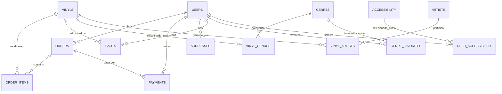

# vinyl-api

API REST do **Vinyl Figures** — backend de uma loja virtual de discos de vinil, desenvolvida em **Java + Spring Boot** com persistência em **PostgreSQL**. Este repositório contém apenas a API (autenticação, catálogo, carrinho, pedidos e pagamentos); o front-end (JS vanilla) consome estes endpoints via HTTP.

> ⚠️ Se este projeto está sendo entregue como **tema alternativo** ao tema-base (Action Figures), lembre-se de referenciar aqui a aprovação por escrito obtida na Aula 1, conforme a Seção 9 da rubrica.

## Sumário

- [vinyl-api](#vinyl-api)
  - [Sumário](#sumário)
  - [Stack tecnológica](#stack-tecnológica)
  - [Arquitetura do projeto](#arquitetura-do-projeto)
  - [Pré-requisitos](#pré-requisitos)
  - [Variáveis de ambiente](#variáveis-de-ambiente)
  - [Como rodar o projeto](#como-rodar-o-projeto)
    - [1. Subir o PostgreSQL e criar o banco](#1-subir-o-postgresql-e-criar-o-banco)
    - [2. Criar as tabelas manualmente](#2-criar-as-tabelas-manualmente)
    - [3. Exportar as variáveis de ambiente](#3-exportar-as-variáveis-de-ambiente)
    - [4. Rodar a aplicação](#4-rodar-a-aplicação)
    - [Alternativa: rodar com Docker](#alternativa-rodar-com-docker)
    - [Testando os endpoints](#testando-os-endpoints)
  - [Estrutura do banco de dados](#estrutura-do-banco-de-dados)
    - [Tabelas](#tabelas)
  - [Autenticação](#autenticação)
  - [Endpoints da API](#endpoints-da-api)
    - [Usuários e autenticação](#usuários-e-autenticação)
    - [Endereços](#endereços)
    - [Catálogo — vinis](#catálogo--vinis)
    - [Artistas, gêneros e acessibilidade (CRUD genérico)](#artistas-gêneros-e-acessibilidade-crud-genérico)
    - [Vínculo vinil ↔ artista / vinil ↔ gênero](#vínculo-vinil--artista--vinil--gênero)
    - [Gêneros favoritos](#gêneros-favoritos)
    - [Acessibilidade do usuário](#acessibilidade-do-usuário)
    - [Carrinho](#carrinho)
    - [Pedidos](#pedidos)
    - [Pagamentos](#pagamentos)
  - [Exemplos de uso](#exemplos-de-uso)
  - [Formato de erros](#formato-de-erros)
  - [Integrantes](#integrantes)
  - [Declaração de uso de IA](#declaração-de-uso-de-ia)
  - [Licença](#licença)

## Stack tecnológica

| Camada | Tecnologia |
|---|---|
| Linguagem | Java 21 |
| Framework | Spring Boot 4.1.0 (Web MVC, Data JPA, Validation) |
| Banco de dados | PostgreSQL |
| Autenticação | JWT (biblioteca `jjwt`) |
| Hash de senha | Argon2i (`argon2-jvm`), com *pepper* adicional |
| Build | Maven (via `mvnw`/`mvnw.cmd`) |
| Empacotamento | Docker (multi-stage: build com JDK 21, execução com JRE 21) |
| Boilerplate | Lombok |

## Arquitetura do projeto

Organização em camadas, por pacote:

```
controller/   → endpoints REST (recebe request, delega ao service)
  base/       → classes genéricas de CRUD reaproveitadas pelos controllers simples
  join/       → controllers de tabelas de associação (N:N)
service/      → regras de negócio
  base/       → lógica genérica de CRUD e de associação vinil↔entidade
repository/   → interfaces Spring Data JPA
model/        → entidades JPA
  join/       → entidades de tabelas de associação
dto/          → records de request/response (entrada e saída da API)
enums/        → PaymentMethod, PaymentStatus
common/
  config/     → CORS, propriedades de JWT
  security/   → filtro JWT, geração/validação de token, usuário autenticado da requisição
  exceptions/ → exceções de negócio (404, 409, 403, 401, 400)
  GlobalExceptionHandler → converte exceções em respostas JSON padronizadas
utils/        → Hash (Argon2i + pepper), Validation (checagem de ownership)
```

Vários recursos simples (Artist, Genre, Accessibility) reutilizam um **CRUD genérico** (`ControllerBase`/`ServiceBase`), e as tabelas de associação vinil↔gênero e vinil↔artista reutilizam um **controller/service de associação genérico** (`VinylJoinControllerBase`/`JoinVinylBase`).

## Pré-requisitos

- JDK 21
- PostgreSQL 14+ (local ou em container)
- Não é necessário instalar o Maven — o projeto usa o Maven Wrapper (`./mvnw`)

## Variáveis de ambiente

Nenhuma tem valor padrão no `application.properties`, exceto onde indicado — a aplicação **não sobe sem elas**.

| Variável | Obrigatória | Exemplo | Descrição |
|---|---|---|---|
| `DB_URL` | Sim | `jdbc:postgresql://localhost:5432/vinyl_db` | URL JDBC de conexão com o PostgreSQL |
| `DB_USERNAME` | Sim | `vinyl_user` | Usuário do banco |
| `DB_PASSWORD` | Sim | `********` | Senha do banco |
| `APP_CORS_ALLOWED_ORIGINS` | Sim | `http://localhost:5500,http://127.0.0.1:5500` | Origem(ns) do front-end liberadas no CORS para `/api/**` (aceita lista separada por vírgula) |
| `JWT_SECRET` | Sim | uma string aleatória de 32+ caracteres | Chave usada para assinar/validar os tokens JWT (HMAC) |
| `JWT_EXPIRATION_MINUTES` | Não (default `60`) | `60` | Tempo de expiração do token, em minutos |
| `PEPPER` | Sim | outra string secreta | "Pimenta" extra concatenada à senha antes do hash Argon2i. **Não é uma propriedade do Spring** — é lida diretamente do ambiente via `System.getenv("PEPPER")` em `utils/Hash.java`, então precisa existir como variável de ambiente do processo mesmo fora do Spring |

Exemplo de arquivo `.env` (para uso com `--env-file` no Docker, ou exportando manualmente as variáveis no terminal):

```env
DB_URL=jdbc:postgresql://localhost:5432/vinyl_db
DB_USERNAME=vinyl_user
DB_PASSWORD=troque_esta_senha
APP_CORS_ALLOWED_ORIGINS=http://localhost:5500
JWT_SECRET=troque-por-uma-chave-longa-e-aleatoria
JWT_EXPIRATION_MINUTES=60
PEPPER=troque-por-outra-chave-secreta
```

## Como rodar o projeto

### 1. Subir o PostgreSQL e criar o banco

```bash
# exemplo rápido via Docker
docker run --name vinyl-db -e POSTGRES_USER=vinyl_user -e POSTGRES_PASSWORD=troque_esta_senha \
  -e POSTGRES_DB=vinyl_db -p 5432:5432 -d postgres:16
```

### 2. Criar as tabelas manualmente

`spring.jpa.hibernate.ddl-auto=none` está definido no `application.properties` — o Hibernate **não** cria o schema sozinho. Além disso, `spring.sql.init.mode=always` só executa `schema.sql`/`data.sql` na raiz do classpath por padrão, e o script deste projeto está em `src/main/resources/sql/script.sql` (fora do local padrão), então **ele não roda automaticamente** ao subir a aplicação. É preciso executá-lo manualmente uma vez, contra o banco criado no passo 1:

```bash
psql -h localhost -U vinyl_user -d vinyl_db -f src/main/resources/sql/script.sql
```

> O script começa com `DROP SCHEMA IF EXISTS PUBLIC CASCADE`, então também serve para resetar o banco do zero quando precisar.

### 3. Exportar as variáveis de ambiente

```bash
export DB_URL=jdbc:postgresql://localhost:5432/vinyl_db
export DB_USERNAME=vinyl_user
export DB_PASSWORD=troque_esta_senha
export APP_CORS_ALLOWED_ORIGINS=http://localhost:5500
export JWT_SECRET=troque-por-uma-chave-longa-e-aleatoria
export PEPPER=troque-por-outra-chave-secreta
```

(No Windows/PowerShell, use `$env:DB_URL="..."` para cada variável.)

### 4. Rodar a aplicação

```bash
./mvnw spring-boot:run
```

A API sobe em `http://localhost:8080`, com todos os endpoints sob o prefixo `/api/v1`.

### Alternativa: rodar com Docker

```bash
docker build -t vinyl-api .
docker run --env-file .env -p 8080:8080 vinyl-api
```

O passo 2 (criação das tabelas) continua sendo necessário à parte — o Dockerfile empacota só o `.jar` da aplicação, não inicializa o banco.

### Testando os endpoints

O repositório já inclui uma coleção pronta em `src/main/resources/http/dataload.http`, com todos os endpoints, exemplos de payload e um fluxo completo (criar usuário → login → criar vinil → carrinho → checkout → pagamento). Ela usa a sintaxe do HTTP Client do IntelliJ IDEA/WebStorm — basta abrir o arquivo com a IDE e rodar as requisições em ordem.

## Estrutura do banco de dados



### Tabelas

| Tabela | Colunas principais | Observações |
|---|---|---|
| `users` | `id`, `name`, `document` (CPF, 11 dígitos, único), `cellphone` (único), `email` (único), `password` (hash Argon2i) | |
| `vinyls` | `id`, `title`, `price` (> 0), `description`, `released_at` (ano, `CHAR(4)`), `image_url` | |
| `orders` | `id`, `id_user` → `users`, `total_price`, `created_at` | Criada no checkout |
| `order_items` | `id`, `id_order` → `orders` (`ON DELETE CASCADE`), `id_vinyl` → `vinyls`, `price_at_purchase` | Guarda o preço no momento da compra, mesmo que o vinil mude de preço depois |
| `payments` | `id`, `value`, `payment_method` (enum), `status` (enum), `created_at`, `id_user` → `users`, `id_order` → `orders` (opcional) | |
| `artists` | `id`, `name`, `description` | |
| `genres` | `id`, `name` (único) | |
| `accessibility` | `id`, `name`, `description` | Recursos de acessibilidade disponíveis (ex.: audiodescrição) |
| `vinyl_genres` | `id`, `id_vinyl`, `id_genre` (par único) | N:N entre vinis e gêneros |
| `vinyl_artists` | `id`, `id_vinyl`, `id_artist` (par único) | N:N entre vinis e artistas |
| `genre_favorites` | `id`, `id_user`, `id_genre` (par único) | Gêneros favoritados por usuário |
| `user_accessibility` | `id`, `id_user`, `id_accessibility` (par único) | Recursos de acessibilidade selecionados por usuário |
| `carts` | `id`, `id_user`, `id_vinyl` (par único) | Carrinho é persistido no banco, por usuário |
| `addresses` | `id`, `number`, `complement`, `zip_code` (CEP, 8 dígitos), `id_user` → `users` | |

Tipos enumerados no PostgreSQL:
- `payment_method`: `DEBITO`, `CREDITO`, `PIX`, `BOLETO`, `TED`
- `status` (pagamento): `PENDENTE`, `APROVADO`, `CANCELADO`

Script completo em [`src/main/resources/sql/script.sql`](src/main/resources/sql/script.sql).

## Autenticação

- Login em `POST /api/v1/auth/tokens` retorna um token JWT.
- Todas as rotas exigem o header `Authorization: Bearer <token>`, **exceto**:
  - `POST /api/v1/users` (criar usuário)
  - `POST /api/v1/auth/tokens` (login)
- O token carrega o `id` do usuário no `subject` e expira em `JWT_EXPIRATION_MINUTES` minutos.
- Em rotas de recursos "pessoais" (endereços, carrinho, pedidos, favoritos, acessibilidade do usuário), a API valida que o `userId` do path é o mesmo do token — caso contrário, responde `403`.

## Endpoints da API

Prefixo comum: `http://localhost:8080/api/v1`

### Usuários e autenticação

| Método | Rota | Auth | Descrição |
|---|---|---|---|
| POST | `/users` | Pública | Cria um novo usuário |
| GET | `/users` | Bearer | Lista todos os usuários |
| GET | `/users/{id}` | Bearer | Busca usuário por id |
| PATCH | `/users/{id}` | Bearer (dono) | Atualiza parcialmente nome/celular/e-mail/senha |
| DELETE | `/users/{id}` | Bearer (dono) | Remove o usuário |
| POST | `/auth/tokens` | Pública | Login — retorna `token`, `tokenType`, `expiresIn`, `userId` |

### Endereços

| Método | Rota | Auth | Descrição |
|---|---|---|---|
| GET | `/users/{userId}/addresses` | Bearer (dono) | Lista endereços do usuário |
| POST | `/users/{userId}/addresses` | Bearer (dono) | Cria endereço |
| GET | `/addresses/{addressId}` | Bearer (dono) | Busca endereço por id |
| PATCH | `/addresses/{addressId}` | Bearer (dono) | Atualiza endereço (ver limitação: `number`/`zipCode` continuam obrigatórios) |
| DELETE | `/addresses/{addressId}` | Bearer (dono) | Remove endereço |

### Catálogo — vinis

| Método | Rota | Auth | Descrição |
|---|---|---|---|
| GET | `/vinyls?genreId=&artistId=` | Bearer | Lista vinis, com filtro opcional por gênero ou artista |
| POST | `/vinyls` | Bearer | Cria vinil |
| GET | `/vinyls/{id}?expand=genres,artists` | Bearer | Busca vinil por id; `expand` opcional traz gêneros e/ou artistas vinculados |
| PATCH | `/vinyls/{id}` | Bearer | Atualiza parcialmente (campos nulos são ignorados) |

### Artistas, gêneros e acessibilidade (CRUD genérico)

O mesmo conjunto de rotas se repete para os três recursos abaixo, trocando apenas `{recurso}`:

| Método | Rota | Auth | Descrição |
|---|---|---|---|
| GET | `/{recurso}` | Bearer | Lista todos |
| POST | `/{recurso}` | Bearer | Cria |
| GET | `/{recurso}/{id}` | Bearer | Busca por id |
| PATCH | `/{recurso}/{id}` | Bearer | Atualiza parcialmente |
| DELETE | `/{recurso}/{id}` | Bearer | Remove |

Onde `{recurso}` é `artists`, `genres` ou `accessibility`.

### Vínculo vinil ↔ artista / vinil ↔ gênero

| Método | Rota | Auth | Descrição |
|---|---|---|---|
| GET | `/vinyls/{vinylId}/artists` | Bearer | Lista artistas vinculados ao vinil |
| POST | `/vinyls/{vinylId}/artists` | Bearer | Vincula artista ao vinil (body: `{ "artistId": n }`) |
| DELETE | `/vinyls/{vinylId}/artists` | Bearer | - |
| GET | `/vinyls/{vinylId}/genres` | Bearer | Lista gêneros vinculados ao vinil |
| POST | `/vinyls/{vinylId}/genres` | Bearer | Vincula gênero ao vinil (body: `{ "genreId": n }`) |
| DELETE | `/vinyls/{vinylId}/genres` | Bearer | - |

### Gêneros favoritos

| Método | Rota | Auth | Descrição |
|---|---|---|---|
| GET | `/users/{userId}/favoriteGenres` | Bearer (dono) | Lista gêneros favoritos do usuário |
| POST | `/users/{userId}/favoriteGenres` | Bearer (dono) | Favorita um gênero (body: `{ "genreId": n }`) |
| DELETE | `/users/{userId}/favoriteGenres/{genreId}` | Bearer (dono) | Desfavorita |

### Acessibilidade do usuário

| Método | Rota | Auth | Descrição |
|---|---|---|---|
| GET | `/users/{userId}/accessibility` | Bearer (dono) | Lista recursos de acessibilidade selecionados |
| POST | `/users/{userId}/accessibility` | Bearer (dono) | Seleciona um recurso (body: `{ "accessibilityId": n }`) |
| DELETE | `/users/{userId}/accessibility/{accessibilityId}` | Bearer (dono) | Remove a seleção |

### Carrinho

| Método | Rota | Auth | Descrição |
|---|---|---|---|
| GET | `/users/{userId}/cartItems?expand=vinyl` | Bearer (dono) | Lista itens do carrinho; `expand=vinyl` traz um resumo do vinil (id, título, preço) |
| POST | `/users/{userId}/cartItems/bulk` | Bearer (dono) | Adiciona vários vinis de uma vez (body: `{ "vinylIds": [1,2,3] }`); itens já presentes voltam no campo `skipped` da resposta, sem gerar erro |
| DELETE | `/users/{userId}/cartItems/{vinylId}` | Bearer (dono) | Remove um item específico |
| DELETE | `/users/{userId}/cartItems` | Bearer (dono) | Esvazia o carrinho inteiro |

### Pedidos

| Método | Rota | Auth | Descrição |
|---|---|---|---|
| GET | `/users/{userId}/orders` | Bearer (dono) | Lista pedidos do usuário |
| POST | `/orders` | Bearer | Faz checkout: cria o pedido a partir do carrinho atual do usuário (body: `{ "userId": n }`) e **esvazia o carrinho automaticamente** |
| GET | `/orders/{orderId}?expand=items` | Bearer (dono) | Busca pedido por id; `expand=items` inclui os itens do pedido |
| DELETE | `/orders/{orderId}` | Bearer (dono) | Remove o pedido |
| GET | `/orders/{orderId}/items` | Bearer (dono) | Lista os itens do pedido |

### Pagamentos

| Método | Rota | Auth | Descrição |
|---|---|---|---|
| GET | `/payments?userId=&orderId=&status=&paymentMethod=` | Bearer | Lista pagamentos, com filtros opcionais combináveis |
| POST | `/payments` | Bearer | Registra um pagamento (vinculado ou não a um pedido) |
| GET | `/payments/{id}` | Bearer | Busca pagamento por id |
| PATCH | `/payments/{id}` | Bearer | Atualiza o status do pagamento (body: `{ "status": "APROVADO" }`) |

> Não existe `DELETE /payments/{id}` — é intencional: pagamentos funcionam como um livro-razão (ledger) que não deve ser apagado.

## Exemplos de uso

Fluxo completo com `curl` (Windows: adapte as aspas ou use Git Bash/WSL).

**1. Criar usuário**
```bash
curl -X POST http://localhost:8080/api/v1/users \
  -H "Content-Type: application/json" \
  -d '{
    "name": "Ana Beatriz Souza",
    "document": "52998224725",
    "cellphone": "11987654321",
    "email": "ana.beatriz@example.com",
    "password": "SenhaForte123!"
  }'
```

**2. Login (guarde o `token` da resposta)**
```bash
curl -X POST http://localhost:8080/api/v1/auth/tokens \
  -H "Content-Type: application/json" \
  -d '{ "email": "ana.beatriz@example.com", "password": "SenhaForte123!" }'
```

**3. Criar um vinil**
```bash
curl -X POST http://localhost:8080/api/v1/vinyls \
  -H "Content-Type: application/json" \
  -H "Authorization: Bearer SEU_TOKEN" \
  -d '{
    "title": "The Dark Side of the Moon",
    "price": 129.90,
    "description": "Álbum icônico lançado em 1973.",
    "releasedAt": "1973",
    "imageUrl": "https://example.com/images/dark-side-of-the-moon.jpg"
  }'
```

**4. Listar vinis**
```bash
curl http://localhost:8080/api/v1/vinyls -H "Authorization: Bearer SEU_TOKEN"
```

**5. Adicionar ao carrinho (bulk)**
```bash
curl -X POST http://localhost:8080/api/v1/users/1/cartItems/bulk \
  -H "Content-Type: application/json" \
  -H "Authorization: Bearer SEU_TOKEN" \
  -d '{ "vinylIds": [1] }'
```

**6. Checkout**
```bash
curl -X POST http://localhost:8080/api/v1/orders \
  -H "Content-Type: application/json" \
  -H "Authorization: Bearer SEU_TOKEN" \
  -d '{ "userId": 1 }'
```

**7. Registrar pagamento**
```bash
curl -X POST http://localhost:8080/api/v1/payments \
  -H "Content-Type: application/json" \
  -H "Authorization: Bearer SEU_TOKEN" \
  -d '{
    "userId": 1,
    "orderId": 1,
    "value": 129.90,
    "paymentMethod": "PIX",
    "status": "PENDENTE"
  }'
```

Mais exemplos, incluindo casos de erro (401, 400, 403, 409), estão em [`src/main/resources/http/dataload.http`](src/main/resources/http/dataload.http).

## Formato de erros

Todas as respostas de erro seguem o mesmo formato:

```json
{
  "messages": ["descrição do erro"],
  "status": 400
}
```

| Status | Quando ocorre |
|---|---|
| 400 | Corpo/parâmetro inválido, tipo incorreto, parâmetro obrigatório ausente, violação de `@Valid` |
| 401 | Token ausente, mal formado, inválido ou expirado; login com credenciais erradas |
| 403 | Tentativa de acessar/alterar um recurso que não pertence ao usuário autenticado |
| 404 | Recurso não encontrado |
| 405 | Método HTTP não suportado na rota |
| 409 | Conflito (ex.: e-mail/documento duplicado, nome de gênero repetido) |
| 415 | `Content-Type` não suportado |
| 500 | Erro inesperado |

## Integrantes

| Nome | Função no projeto |
|---|---|
| Cibelle Goltara | UX/UI/Design |
| Davi Aliaga | Desenvolvedor Backend |
| Davi Liu | Dados |
| Lucas Ramos | Dados |
| Vinícius de Oliveira | Desenvolvedor Frontend |

## Declaração de uso de IA

Este README foi redigido com apoio do **Claude (Anthropic)**, que leu diretamente o código-fonte do repositório (controllers, DTOs, `script.sql`, `application.properties`, `Dockerfile` e a coleção `dataload.http` já existente) para garantir que os endpoints, exemplos, estrutura do banco e variáveis de ambiente documentados aqui refletem o que está realmente implementado.

| Parte do código | Ferramenta de IA | O que foi gerado/apoiado | Nível de revisão feito pelo grupo |
|---|---|---|---|
| `ServiceBase` / `ControllerBase` (CRUD genérico) | Claude (Anthropic) | Esqueleto das classes genéricas de CRUD reaproveitadas por Artist, Genre e Accessibility | Revisado e adaptado por Davi Aliaga, ajustando tratamento de exceções específicas |
| `VinylJoinControllerBase` / `JoinVinylBase` | Claude (Anthropic) | Estrutura genérica para os vínculos N:N (vinil↔gênero e vinil↔artista) | Revisado por Davi Aliaga; testado manualmente contra os endpoints de `dataload.http` |
| `utils/Hash.java` (Argon2i + pepper) | ChatGPT | Sugestão de implementação do hash de senha com *pepper* lido via `System.getenv` | Revisado por Davi Aliaga, validado com testes de login/registro |
| Filtro JWT e geração/validação de token (`common/security`) | Claude (Anthropic) | Apoio na estrutura do filtro de autenticação e nas classes de geração/validação do token | Revisado e ajustado por Davi Aliaga |
| `GlobalExceptionHandler` | ChatGPT | Padronização do formato de resposta de erro (`messages` + `status`) | Revisado por Davi Aliaga, adequado aos códigos 400/401/403/404/409/415/500 |
| `script.sql` (schema do banco) | Claude (Anthropic) | Apoio na modelagem das tabelas, chaves estrangeiras e enums (`payment_method`, `status`) | Revisado por Davi Liu e Lucas Ramos, validado com o diagrama ER |
| `dataload.http` (coleção de testes) | Claude (Anthropic) | Geração dos exemplos de requisição/payload para o fluxo completo (usuário → login → vinil → carrinho → checkout → pagamento) | Revisado e testado manualmente por Davi Aliaga e Vinícius de Oliveira |
| README.md | Claude (Anthropic) | Redação do documento a partir da leitura do código-fonte (controllers, DTOs, `script.sql`, `application.properties`, `Dockerfile`) | Revisado por todo o grupo antes da entrega |
| Mapeamento de endpoints | Claude (Anthropic) | Documento listando todos os endpoints da API com argumentos necessários | Revisado por Davi e Vinícius |

## Licença

Distribuído sob a licença MIT — veja [`LICENSE`](LICENSE).